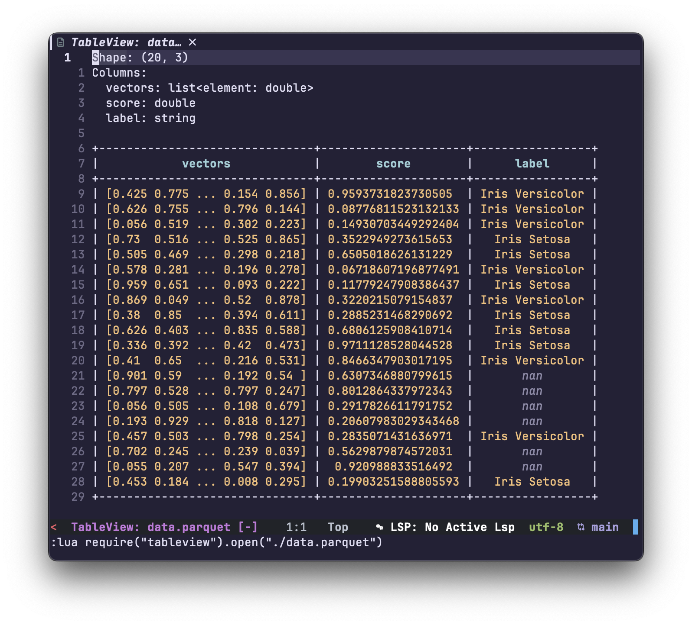

# tableview.nvim

a plugin to open parquet and csv files (wip)



## Installation

### [lazy.nvim](https://github.com/folke/lazy.nvim)

```lua
return {
  "cyprienhm/tableview.nvim",
  opts = {},
}
```

## Usage

Open a parquet file in a new buffer:
`:lua require("tableview").open("./table.parquet")`

Open a csv file in a new buffer:
`:lua require("tableview").open("./table.csv")`

